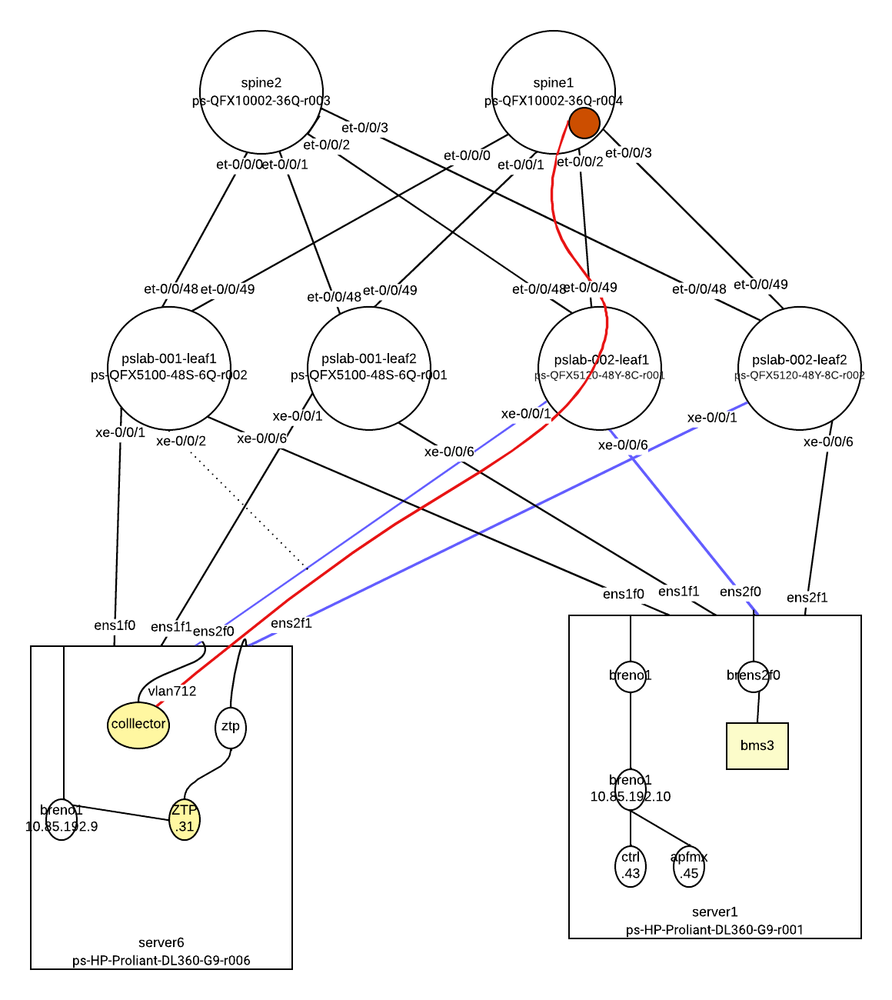
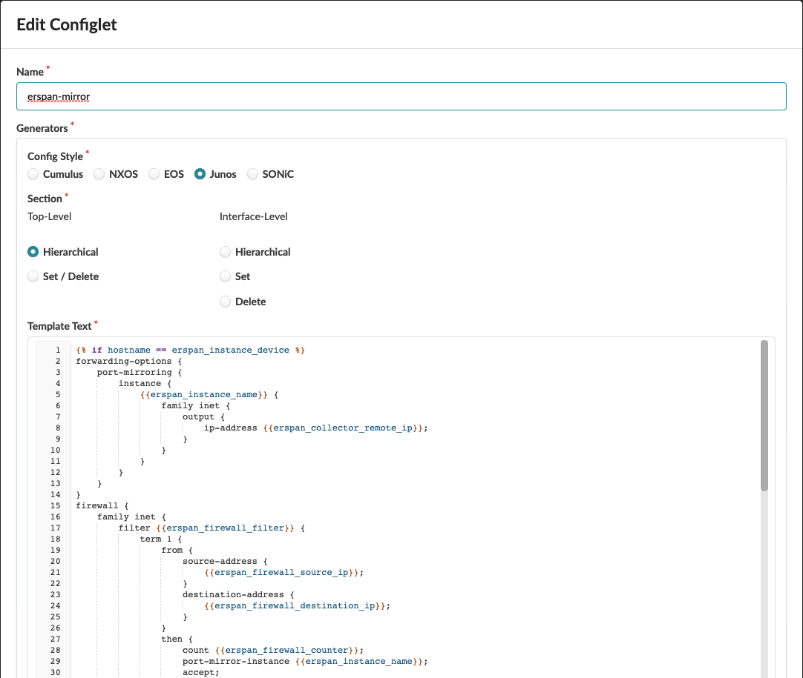
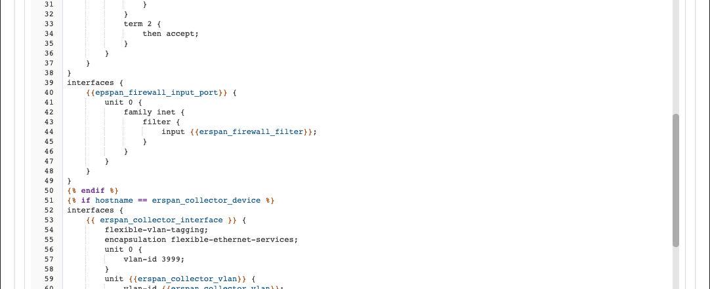
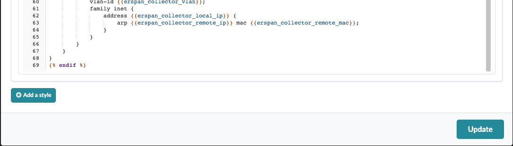

# port-mirror
This configlet is to configure ERSPAN mirroring




# Create Property Set


```yaml
epspan_firewall_input_port: et-0/0/3
erspan_collector_device: pslab-002-leaf1
erspan_collector_interface: xe-0/0/1
erspan_collector_local_ip: 10.7.12.1/24
erspan_collector_remote_ip: 10.7.12.12
erspan_collector_remote_mac: 02:00:77:77:00:12
erspan_collector_vlan: 712
erspan_firewall_counter: mirror-count
erspan_firewall_destination_ip: 10.0.0.0/32
erspan_firewall_filter: mirror-filter
erspan_firewall_source_ip: 10.0.0.5/32
erspan_instance_device: spine1
erspan_instance_name: mirror-name
```

# Create Configlet




[json file](./port-mirror-configlet.json)

# Import Property Set


# Import Configlet

