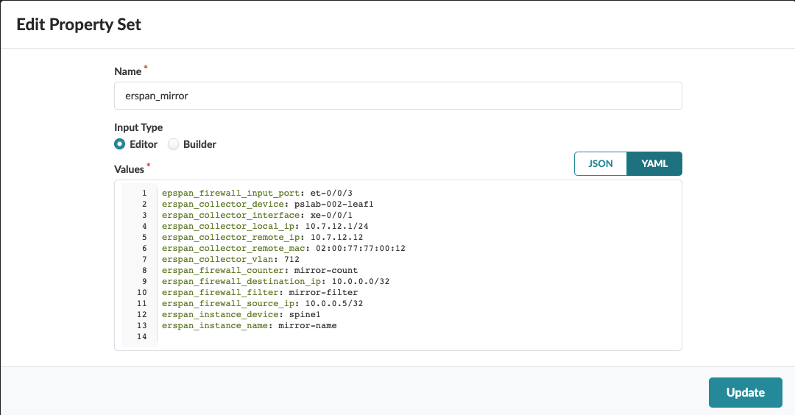
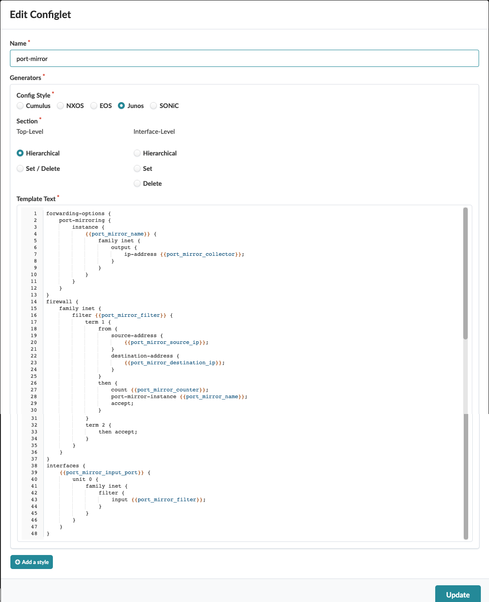
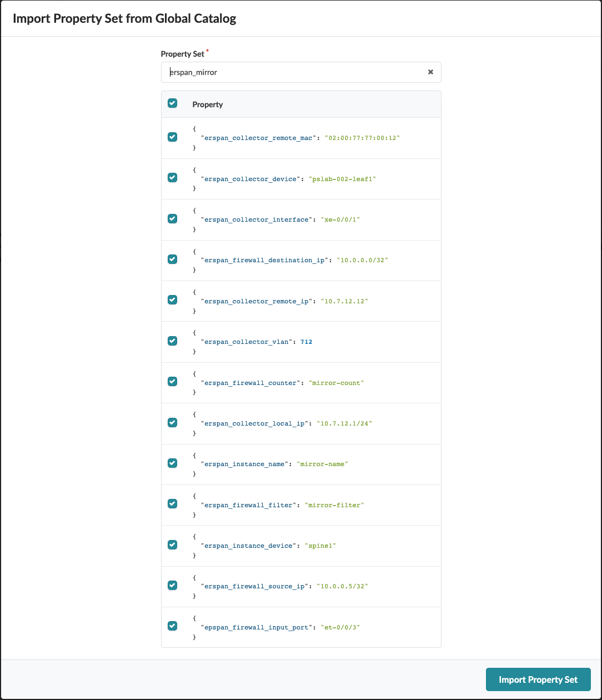
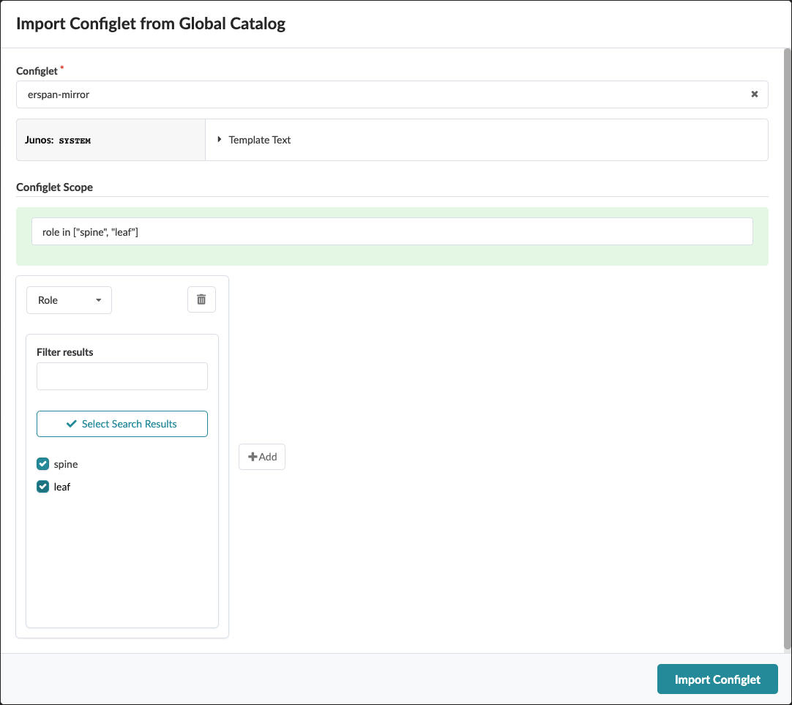

# port-mirror
This configlet is to configure port-mirror

# Create Property Set

# Create Configlet

# Import Property Set

# Import Configlet
Import configlet for the leafs. This example uses tag 'EDGE'.

