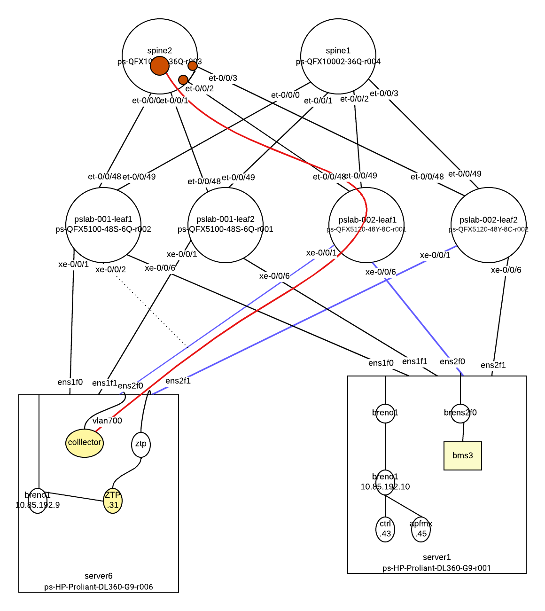
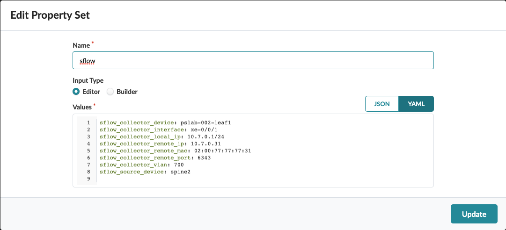
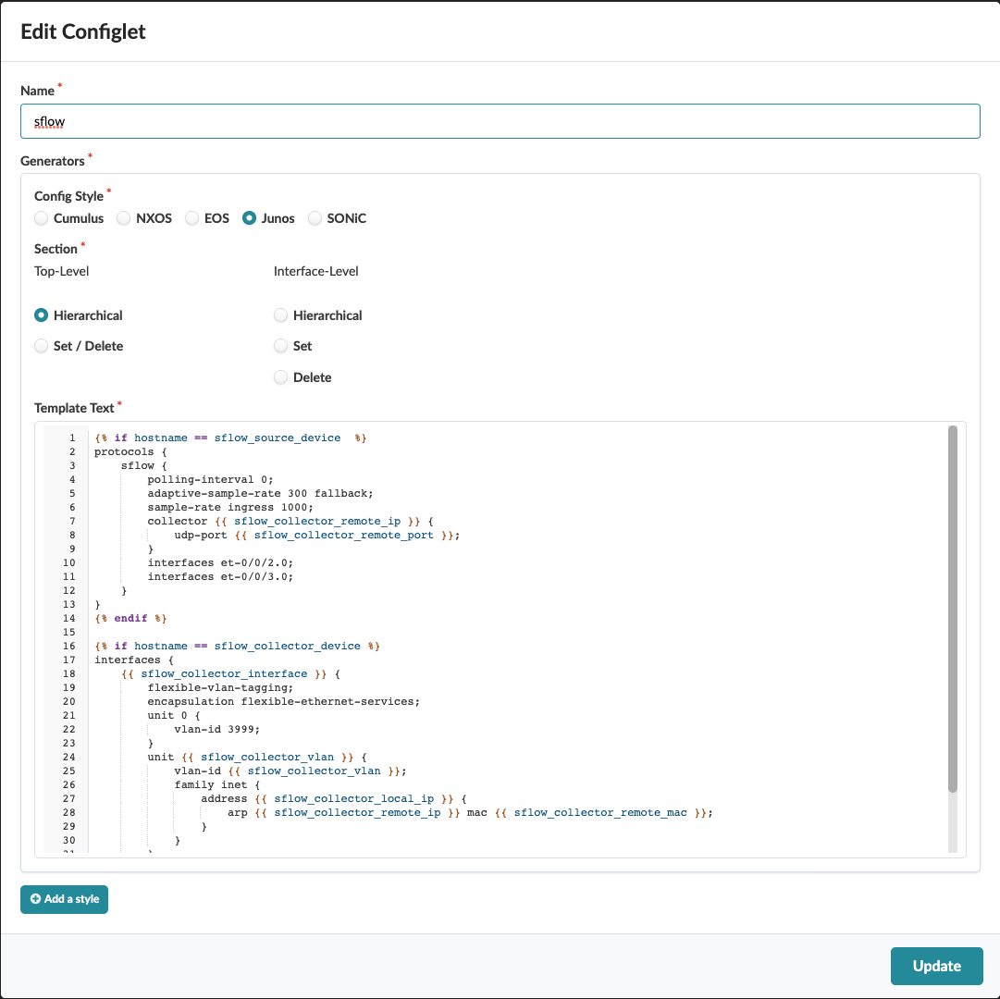
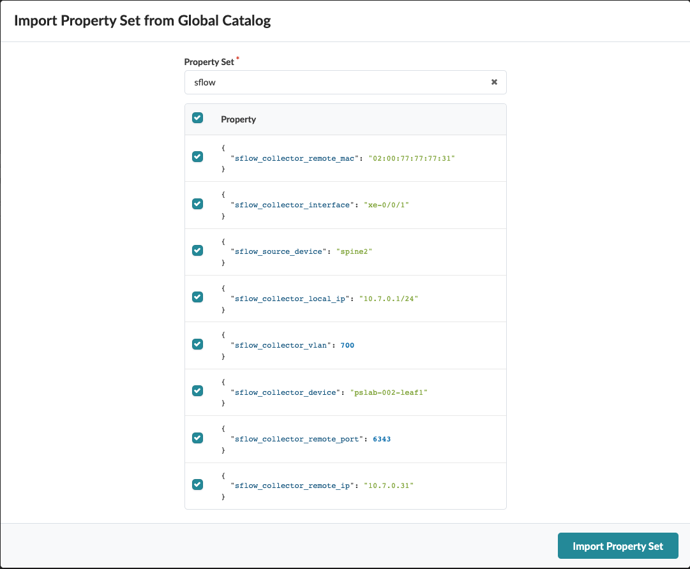
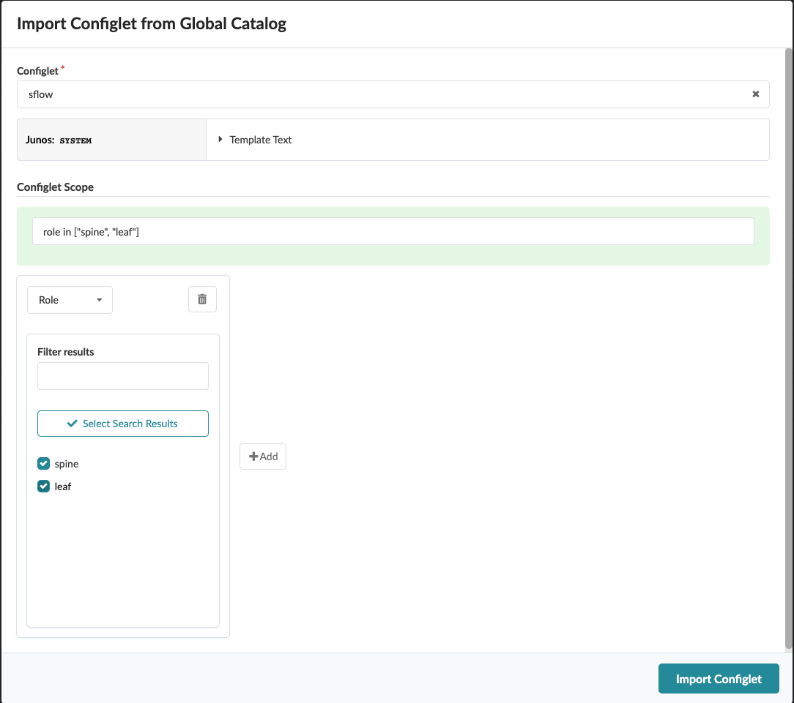

# sflow




# Create Property Set


```yaml
sflow_collector_device: pslab-002-leaf1
sflow_collector_interface: xe-0/0/1
sflow_collector_local_ip: 10.7.0.1/24
sflow_collector_remote_ip: 10.7.0.31
sflow_collector_remote_mac: 02:00:77:77:77:31
sflow_collector_remote_port: 6343
sflow_collector_vlan: 700
sflow_source_device: spine2
```

# Create Configlet


[json file](./sflow-configlet.json)

# Import Property Set


# Import Configlet

